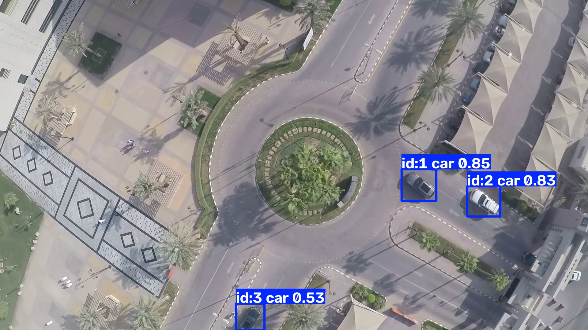
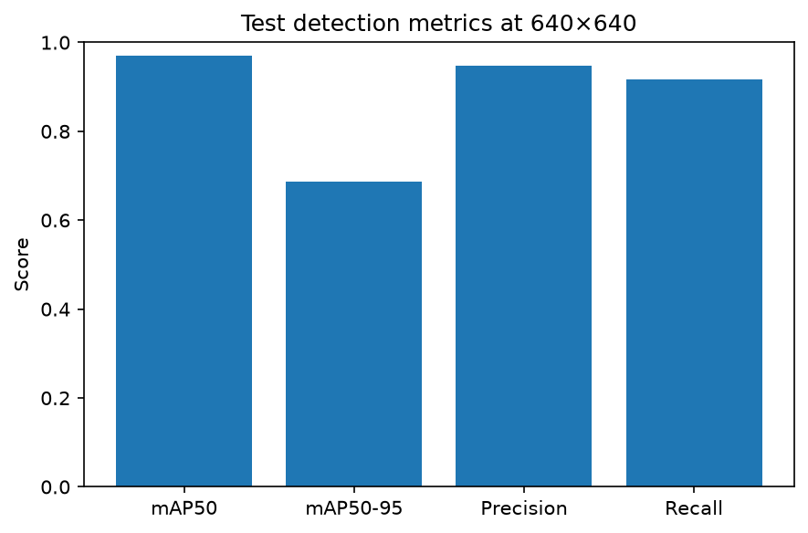

# Aerial Car Tracker

YOLO11 aerial car detection and Jetson Nano DeepStream deployment.

<p align="center">
	
</p>

- Train/export in Colab
- Export and Deploy to Jetson Nano with DeepStream

**Dataset Citation:**  
(https://www.kaggle.com/datasets/riotulab/aerial-images-of-cars)  
Ammar, A., Koubaa, A., Ahmed, M., Saad, A. and Benjdira, B., 2021. Vehicle detection from aerial images using deep learning: A comparative study. Electronics, 10(7), p.820.

## Train

Use [notebooks/aerial_car_tracker_colab.ipynb](/Users/null/Developer/aerial-car-tracker/notebooks/aerial_car_tracker_colab.ipynb) to train the model. The notebook downloads the Kaggle dataset, trains a larger teacher model, then applies knowledge distillation to train a smaller student model for improved efficiency. Validation metrics are reported, and the trained model is exported to ONNX format for optimized deployment.

## Bundle

After copying `exports/training_output` from Colab:

```bash
bash jetson/make_bundle.sh exports/training_output exports/jetson_deepstream_bundle
```

## Deploy

Reference:
https://docs.ultralytics.com/guides/deepstream-nvidia-jetson#what-is-nvidia-deepstream

on the Jetson:

```bash
bash jetson/setup_deepstream_yolo.sh
bash jetson/run_deepstream.sh csi
```

URI/Video:

```bash
bash jetson/run_deepstream.sh uri file:///home/jetson/sample.mp4
```

Note: First run builds the TensorRT engine from ONNX.

## Results

**Metrics**
| split | imgsz | mAP50  | mAP50-95 | precision | recall |
|------:|------:|-------:|---------:|----------:|-------:|
| test  | 640   | 0.9706 | 0.6860   | 0.9468    | 0.9165 |

<p align="center">
	
</p>

**Jetson Nano 4GB Deployment Performance**
- Throughput: 13.48 FPS via DeepStream
